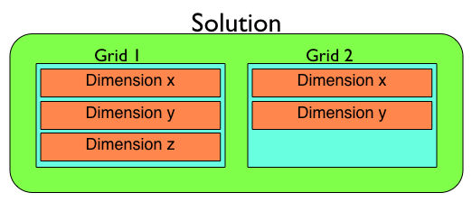

.. _pyclaw_solution:

****************
PyClaw Solutions
****************

PyClaw :class:`~pyclaw.solution.Solution` objects are containers for 
:class:`~pyclaw.state.State` and :class:`~pyclaw.geometry.Domain` objects
that define an entire solution.
The :class:`~pyclaw.state.State` class is responsible for containing all 
the data of the solution on the given :class:`~pyclaw.geometry.Domain`.
The :class:`~pyclaw.geometry.Domain` is responsible for containing
the geometry of the :class:`~pyclaw.solution.Solution`.  The structure of a 
solution may look something like the :ref:`figure <pyclaw_solution_structure>`.

.. _pyclaw_solution_structure:

   
   Pyclaw solution structure including a :class:`~pyclaw.geometry.Domain`,
   a set of :class:`~pyclaw.geometry.Patch` objects and corresponding 
   :class:`~pyclaw.geometry.Dimension` objects defining the solution's
   geometry and three :class:`~pyclaw.state.State` objects pointing to 
   the appropriate :class:`~pyclaw.geometry.Patch` with varying fields.
    

List of serial and parallel objects in a :class:`~pyclaw.solution.Solution` class:

+------------------------------------+-------------------------------------+
| Serial                             | Parallel                            |
+====================================+=====================================+
| :class:`pyclaw.state.State`        | :class:`petclaw.state.State`        |
+------------------------------------+-------------------------------------+
| :class:`pyclaw.geometry.Domain`    | :class:`petclaw.geometry.Domain`    |
+------------------------------------+-------------------------------------+
| :class:`pyclaw.geometry.Patch`     | :class:`petclaw.geometry.Patch`     |
+------------------------------------+-------------------------------------+
| :class:`pyclaw.geometry.Grid`      |                                     |
+------------------------------------+-------------------------------------+
| :class:`pyclaw.geometry.Dimension` |                                     |
+------------------------------------+-------------------------------------+

.. _Solution:

:class:`pyclaw.solution.Solution`
=================================

.. autoclass:: pyclaw.solution.Solution
   :members:
   :member-order: groupwise
